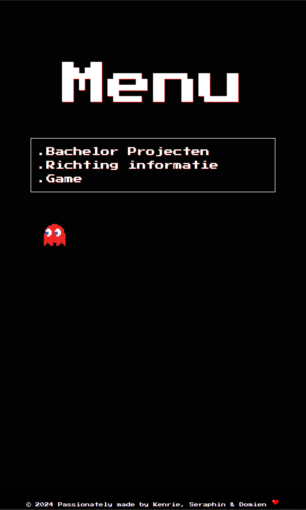
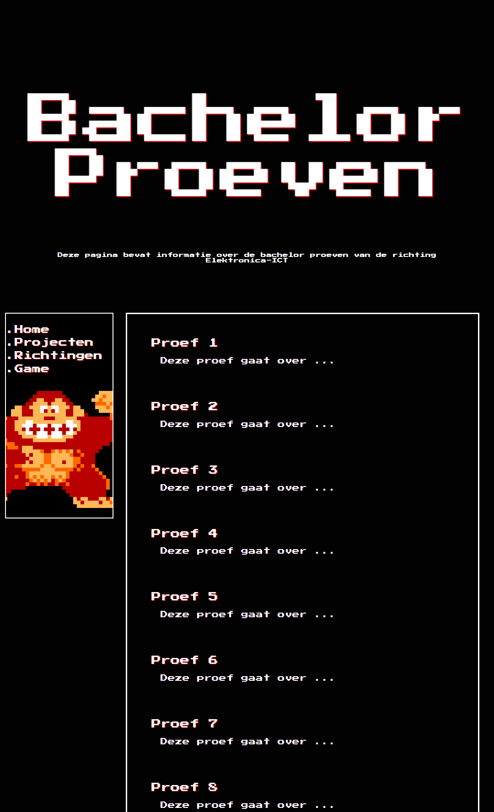
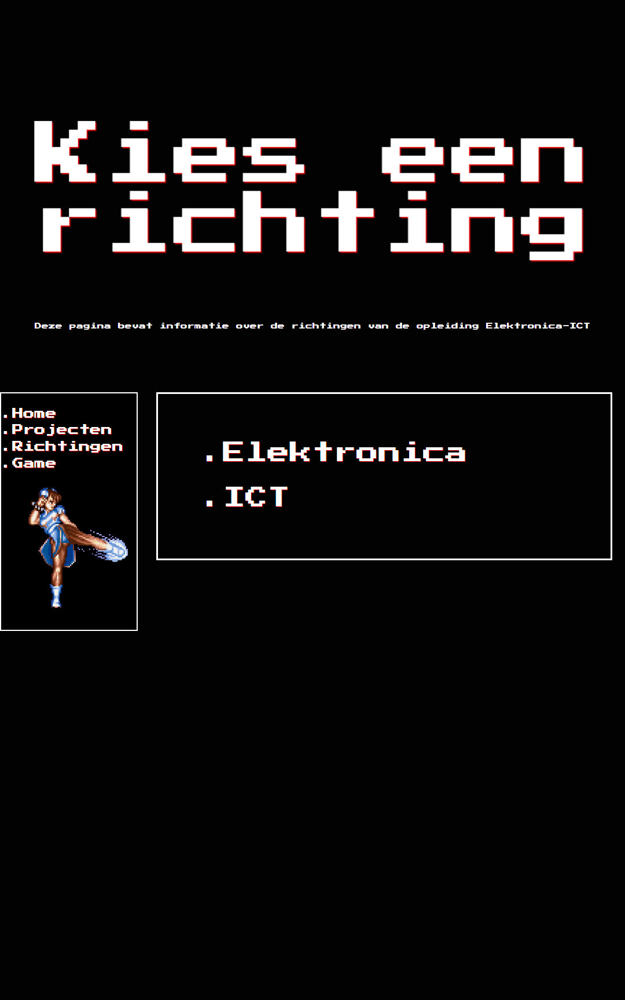

# BachelorproefKiosk

An Arcade Kiosk that shows the bachelor's thesis of previous students.
 
 
## Table of contents

- [BachelorproefKiosk](#BachelorproefKiosk)
  - [Table of contents](#table-of-contents)
  - [The Team](#the-team)
  - [The idea](#the-idea)
    - [Kiosk](#Kiosk)
    - [Website](#Website)
    - [Admin](#Admin)

## The Team

- [Mathieu Leroy](https://github.com/MathieuLeroy2) • Projectleader
- [Seraphin Sampers](https://github.com/SampersS) • Scrum-master
- [Domien Verstraete](https://github.com/Belgianwafflecorp)
- [Kenrie Vandekerckhove](https://github.com/SimonStnn)

## The idea

### Kiosk

- Making a Retro arcade Kiosk from scratch.

### Website

We got 4 different pages:

- Home:
  Starting point to navigate to all the other pages.
  

- Bachelorproeven:
 This shows a list with each bachelor thesis. When you click on a thesis you get more information.
 

- Richting Informatie:
 Here you can find information and pictures of the different Electronica-ICT directions.
 

- Game:
 There are a few games to choose from
 

### Admin

- we gonna add a admin page where you can add en changes the thesises.

  ## 3D model
  We used autodesk inventor for the modeling of the arcade.

### Blueprint:
  

  ### 3D-model:
  

  
